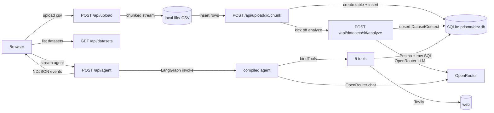

# HelperX

> AI merchant intelligence for your business — turn raw CSV exports into clear
> insights and actionable growth opportunities.

HelperX lets a merchant upload the CSVs they already have (orders,
customers, products, transactions, returns), infers what every column means,
and exposes a natural-language agent that answers business questions using the
merchant's own data. Important findings are saved into a persistent
**logbook** so the agent remembers across sessions.

The repo folder is named `razorpay` (development history) but the product is
branded **HelperX**.

---

## 1. Problem

Most small and mid-sized merchants already sit on a wealth of business data —
they just don't have the time, tooling, or data team to read it. Spreadsheets
show rows; dashboards show charts; neither one explains *what the numbers mean
for the business*.

HelperX bridges that gap:

- It understands your data automatically (column types, joins, semantics).
- It answers business questions in plain English, citing the underlying rows.
- It remembers decisions and findings so the next question is informed by the
  last one.

---

## 2. How It Works

```text
Merchant Data (CSV uploads)
        ↓
Dataset Understanding (semantic analysis via LLM)
        ↓
AI Agent (LangGraph + OpenRouter LLM)
        ↓
Tools:  get_dataset_context · query_dataset · web_search · get_logbook · write_logbook
        ↓
Analysis / Insights (structured cards in the dashboard)
        ↓
Business Memory (Logbook — persists across sessions)
        ↓
Actionable Recommendations
```

End-to-end:

1. **Upload** — Drop one or more `.csv` files on `/upload`. The server streams
   them in 256 KB chunks, sanitizes column names, infers types, and creates a
   local SQLite table per dataset. The original CSV is saved under `./file`.
2. **Understand** — Once upload completes, an LLM pass infers a semantic
   schema (`entity`, `description`, `columns`) for each dataset and stores it
   as `DatasetContext`. Status moves `UPLOADING → ANALYZING → READY`.
3. **Ask** — On the `/dashboard`, select a dataset or run the AI agent. The
   agent (LangGraph) calls tools as needed and returns a formatted answer
   plus structured insights.
4. **Remember** — Important findings are written to the `LogbookEntry` table
   (`ANALYSIS | INSIGHT | DECISION | RESEARCH`) so they are available the next
   time anyone asks.

---

## 3. Key Features

- **Dataset intelligence** — automatic schema inference and semantic context
  for every uploaded CSV.
- **Natural-language questions** — "Which products should I bundle this
  quarter?" answered with real numbers from your data.
- **Agentic analysis** — a LangGraph state machine decides when to query the
  data, search the web, or read/write memory.
- **Safe dataset querying** — read-only SQL through a `query_dataset` tool
  with sanitized identifiers and parameterized filters.
- **Web research** — Tavily-backed `web_search` for current external
  information (competitors, market trends).
- **Persistent business memory** — `LogbookEntry` rows persist analyses,
  insights, decisions, and research across sessions.
- **Audit log** — a slide-out panel tracks every API call, upload chunk,
  agent step, and tool execution in real time.
- **Streaming agent responses** — the dashboard renders agent output as
  newline-delimited JSON events.

---

## 4. Architecture



The two halves — **data ingestion** and **AI agent** — share a local SQLite
database through a single Prisma client (`lib/db.ts`).

---

## 5. Tech Stack

| Area | Technology |
|---|---|
| Framework | [Next.js 16.3.3](https://nextjs.org/) (App Router) + React 19 + TypeScript 5 |
| Styling | Tailwind CSS v4 + a unified design-token system in `app/globals.css` |
| ORM / DB | [Prisma 7](https://www.prisma.io/) with `@prisma/adapter-better-sqlite3`, against local SQLite |
| AI / Agent | [`langchain`](https://js.langchain.com/) 1.5, [`@langchain/langgraph`](https://langchain-ai.github.io/langgraphjs/) 1.4, [`@langchain/openrouter`](https://www.npmjs.com/package/@langchain/openrouter) 0.4 |
| Schema validation | [`zod`](https://zod.dev/) 4 (tool input schemas) |
| CSV parsing | [`papaparse`](https://www.papaparse.com/) 5 |
| Web search | [Tavily](https://tavily.com/) HTTP API |
| Linting | ESLint 9 + `eslint-config-next` |

---

## 6. Project Structure

```
razorpay/
├── app/
│   ├── api/
│   │   ├── analyze/route.ts                # POST — LLM semantic analysis (used by [id]/analyze)
│   │   ├── datasets/
│   │   │   ├── route.ts                    # GET — list datasets (force-dynamic)
│   │   │   └── [id]/analyze/route.ts       # POST — semantic pass for one dataset
│   │   ├── upload/
│   │   │   ├── route.ts                    # POST — create chunked upload session
│   │   │   ├── _lib/session.ts             # session/chunk/ingest helpers
│   │   │   └── [sessionId]/
│   │   │       ├── chunk/route.ts          # PUT — receive one chunk
│   │   │       └── finalize/route.ts       # POST — assemble + ingest + analyze
│   │   └── agent/route.ts                  # POST — streaming LangGraph agent (NDJSON)
│   ├── components/                         # AuditHost, AuditLog
│   ├── hooks/useAuditFetch.ts              # fetch() interceptor → audit events
│   ├── upload/page.tsx                     # CSV upload flow
│   ├── dashboard/page.tsx                  # Workspace + agent
│   ├── page.tsx                            # Marketing landing page
│   ├── layout.tsx                          # Root layout
│   └── globals.css                         # Design tokens + components
├── lib/
│   ├── agent/
│   │   ├── graph.ts                        # LangGraph state graph (agent ↔ tools ↔ format)
│   │   ├── node.ts                         # LLM call + insight extraction
│   │   ├── state.ts                        # AgentState (mode, messages, insights, toolCallCount)
│   │   ├── auditSink.ts                    # global sink for streaming agent events
│   │   └── withAudit.ts                    # wrap each tool for start/end/error logging
│   ├── tools/
│   │   ├── get-dataset-context.ts          # read dataset semantics
│   │   ├── query-dataset.ts                # safe SELECT … WHERE … LIMIT
│   │   ├── web-search.ts                   # Tavily
│   │   ├── get-logbook.ts                  # read LogbookEntry
│   │   └── write-logbook.ts                # create LogbookEntry
│   ├── agentClient.ts                      # client-side NDJSON streaming reader
│   ├── uploadClient.ts                     # client-side chunked upload (with audit)
│   ├── audit.ts                            # client audit store (sessionStorage)
│   ├── serverAudit.ts                      # server-side audit emitter + session helpers
│   └── db.ts                               # PrismaClient singleton (Pg adapter)
├── prisma/
│   └── schema.prisma                       # Dataset, DatasetContext, LogbookEntry
├── prisma7.config.ts                       # Prisma 7 config (datasource URL from env)
├── app/generated/prisma/                   # Generated Prisma client (do not edit)
├── .agents/.claude/.windsurf/skills/       # Per-runner skill packs (Prisma docs)
├── public/                                 # Static SVG assets
├── AGENTS.md                               # Next.js agent rules (managed by `next dev`)
├── CLAUDE.md                               # Imports @AGENTS.md
├── package.json                            # Scripts + dependencies
└── sampleenv                               # Env template
```

---

## 7. Getting Started

Requirements: **Node.js 18+**, an **OpenRouter** API key
(for the LLM), and a **Tavily** API key (for `web_search`; the agent falls
back gracefully if it is missing).

```bash
# 1. Install dependencies
npm install

# 2. Configure environment
cp sampleenv .env
# then edit .env with your keys

# 3. Generate the Prisma client
npm run dev   # Next will invoke Prisma as part of its build / first request
```

The local database is created at `prisma/dev.db`. To create or update its
schema after cloning:

```bash
npx prisma db push
```

Uploaded CSV files are written to `./file`; both paths are git-ignored.

---

## 8. Environment Variables

These are declared in `sampleenv`:

| Variable | Required | Purpose |
|---|---|---|
| `OPENROUTER_API_KEY` | ✅ | Used by `POST /api/analyze` and the LangGraph agent |
| `OPENROUTER_MODEL` | optional | Model name passed to OpenRouter (e.g. `openai/gpt-4o-mini`). Defaults to `openai/gpt-4o-mini` when unset |
| `TAVILY_API_KEY` | optional | Required for the `web_search` tool only; missing → the tool returns an error but other tools keep working |

> **Never commit real secrets.** `.env` is git-ignored.

---

## 9. Running the Project

```bash
npm run dev      # Start the Next.js dev server on http://localhost:3000
npm run build    # Production build
npm run start    # Run the production build
npm run lint     # ESLint via eslint-config-next
```

The landing page is at `/`. The upload flow is at `/upload`. The workspace is
at `/dashboard`. All routes are dynamic where appropriate (`force-dynamic` is
set on dataset and agent routes).

---

## 10. Using HelperX

A typical merchant workflow:

1. **Sign in conceptually** — open `/` to see the marketing landing page and
   what the product does.
2. **Upload your data** — go to `/upload`, drop one or more CSVs (orders,
   customers, products). The UI streams them in chunks; you can queue
   multiple files.
3. **Wait for understanding** — each file moves through `Uploading →
   Analyzing → Ready`. The semantic context is computed by an LLM pass and
   appears in the dashboard.
4. **Open the dashboard** — pick a dataset from the left rail to inspect its
   detected columns and meanings. The right rail shows live metrics and
   opportunities.
5. **Ask the agent** — use the input box at the bottom of the main pane.
   Click **Start analysis** in the right rail to run the
   `initial_analysis` mode (1–3 opportunities) or type a free-form question
   and hit **Ask** for `chat` mode.
6. **Watch the audit log** — click the `Audit` chip in the top-right to open
   the live audit log: API requests, upload chunks, agent tool starts/ends,
   and errors stream in real time.

---

## 11. Agent & Tools

The agent is a LangGraph state graph defined in `lib/agent/graph.ts`:

```text
START → agent → { tools | format }
            ↑        ↓
          tools ←────┘
                   format → END
```

- **`agent`** (`lib/agent/node.ts`) — calls the OpenRouter LLM with the
  system prompt and tool bindings; emits tool calls when needed.
- **`tools`** — a `ToolNode` over the five tools listed below; each tool is
  wrapped by `withAudit()` to emit start/end/error audit events.
- **`format`** — extracts structured `Insight[]` from the transcript with a
  second LLM pass and returns them to the dashboard.

Five tools are available:

| Tool name | Purpose |
|---|---|
| `get_dataset_context` | Returns semantic understanding of `READY` datasets (filterable by `datasetIds` / `tableNames`) |
| `query_dataset` | Read-only `SELECT * FROM "<table>" [WHERE …] [ORDER BY …] LIMIT n` (1–100), parameterized |
| `web_search` | Tavily search, `maxResults` 1–10 |
| `get_logbook` | Read `LogbookEntry` rows; filter by `type` and `from`/`to` dates |
| `write_logbook` | Create a `LogbookEntry` of type `ANALYSIS \| INSIGHT \| DECISION \| RESEARCH` |

The agent's **system prompt** (`lib/agent/node.ts`) encodes four core rules:
never invent numbers, understand before querying, use structured filters
instead of raw SQL, and prioritize merchant data → logbook → web → general
model knowledge.

Tool-call limit is bounded (`MAX_TOOL_CALLS = 8`) and a final synthesis step
forces a text answer when the limit is hit.

---

## 12. Audit Logging

There are two audit surfaces:

- **Client-side** (`lib/audit.ts`, `app/hooks/useAuditFetch.ts`,
  `app/components/AuditLog.tsx`) — every `fetch()` call is intercepted and
  recorded as `api.request` / `api.response` / `api.error`. Upload events
  (`upload.session.create`, `upload.chunk.start`, `upload.chunk.ack`, …) and
  agent streaming events (`agent.start`, `agent.tool.start`,
  `agent.tool.end`, `agent.tool.error`, `agent.end`) are also recorded.
  Events are persisted to `sessionStorage` (capped at 500) and surfaced in a
  slide-out drawer.
- **Server-side** (`lib/serverAudit.ts`,
  `app/api/upload/_lib/session.ts`, `lib/agent/auditSink.ts`) — long-lived
  upload sessions emit events to per-session listeners; the agent route
  installs a global sink that forwards each event to the streaming
  response as an NDJSON line.

The audit log exists to make the system **observable and debuggable** —
you can see exactly what bytes were sent, which tools the agent called, and
where any failure happened.

---

## 13. Database

SQLite is used for two things:

1. **Prisma-managed tables** (`prisma/schema.prisma`):
   - `Dataset` — metadata for each uploaded CSV (filename, sanitized table
     name, row count, columns, status `UPLOADING | ANALYZING | READY |
     FAILED`, optional error).
   - `DatasetContext` — 1:1 semantic context (`table`, `entity`,
     `description`, `columns`).
   - `LogbookEntry` — agent memory (`type`, `title`, `summary`, `evidence`,
     `datasetIds`).
2. **Dynamic per-dataset tables** — for every uploaded CSV, the server
   creates a real SQLite table whose columns are inferred from the CSV
   header (`TEXT | DOUBLE PRECISION | TIMESTAMP`). Rows are inserted in
   batches of 500. The agent queries these via the `query_dataset` tool.

The Prisma client is generated to `app/generated/prisma/`. Do not edit files
in that directory — regenerate with Prisma instead.

---

## 14. Development & Debugging

```bash
npm run lint        # ESLint (eslint-config-next)
npm run build       # Type-check + production build
npx prisma validate # Validate prisma/schema.prisma
npx prisma migrate  # Standard Prisma migration commands
```

A few practical things to know:

- **Chunked uploads** append the CSV to `./file/<datasetId>_<fileName>` while
  inserting each batch into its local SQLite table.
- **Streaming agent** writes one JSON object per line; the client in
  `lib/agentClient.ts` parses each line into either a progress event or a
  final `result` / `error` line.
- The `useAuditFetch` hook must run once (it is mounted in the root layout
  via `<AuditHost />`) — it monkey-patches `window.fetch` to record every
  request.

---

## 15. Future Improvements

Things that are clearly implied by the current codebase but not yet
implemented:

- A proper authentication layer — every route currently assumes a single
  merchant.
- A dedicated **logbook view** in the dashboard (the table exists and the
  agent can write to it; the UI currently shows insights only).
- A **dataset detail panel** that surfaces row samples, row counts, and the
  detected joins between datasets (the data is there, the UI is partial).
- **Background jobs** for the analyze pass — currently triggered inline at
  the end of finalize; should move to a queue for large uploads.

---

## 16. License

No license file is currently present in this repository. Unless a license is
added later, **all rights are reserved by the original author**. If you
intend to reuse, fork, or distribute this code, please add a `LICENSE` file
first.
# HelperX

